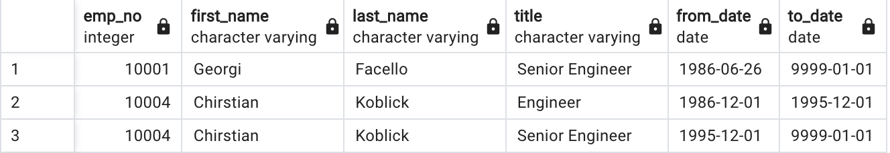
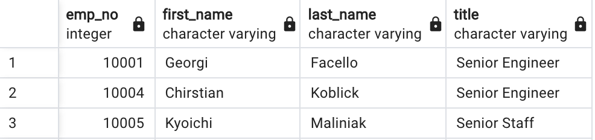
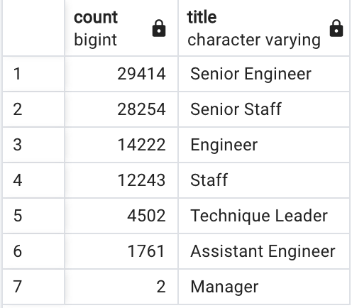
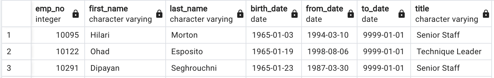
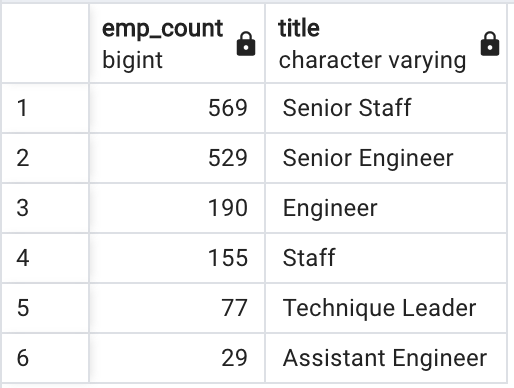

# Employee Database with SQL

## Project Overview
---

The client, an HR analyst for Pewlett Hackard, Bobby, will require assistance in analyzing employee data in the form of *.csv* files. The purpose of analyzing the data is to set up the company to be future-proof, in the occurence of retirements, offering the respective packages, and planning the refilling of those roles.

 

## Results
---

The deliverables were to create:

1. a list of retiring employees, and
2. a list of employees eligible for the mentorship program

 

1. List of Retiring Employees:

    * Three tables were built- *retirement_titles.csv, unique_titles.csv,* and *retiring_titles.csv*
    * The first table represents the number of employees retiring, while the second table, essentially, represents the first table without duplicates, as seen below-

        

            
        
 
        

            
        

    * The total number of rows in the first table is 133,776, whereas the total number of rows in the second table is 90, 398. The second table's rows is the true representation.

    * The third table represents the total number of employees, when grouped by titles

        

            
        

 

2. Eligibility for Mentorship Program:

    * The table provides the following details-

        

            
        

    * The total number of rows in the table is 1,549
    * Here's a representation of the number of employees eligible for the mentorship program, by titles-

        

            
        
 
    * Employee age and date of joining do not impact their eligibility

 

## Summary
---

The number of employees potentially leaving Pewlett Hackard is 90,398. The number of employees who will potentially remain with the company is 33,118. So, approxiametely, there is delta of 57,000 employees that Pewlett Hackard needs to recruit. 

The ratio of mentorship-eligible employees (even those soon to leave) to employees currently employed with Pewlett Hackard is about 1:3. However, it is important to note that this is a very ideal ratio that is heavily dependent on the majority of retirement-ready as well as mentorship-eligible employees staying back to mentor.

A couple queries that may be valuable in preparing for the "silver tsunami" are- 1. to broaden the criteria for mentorship eligibility such as the employee's birth date, and 2. As shown in the snippet from the mentorship eligibility results, representing the strength of employees on the basis of their title or salary may be more valuable than their birth date, since experience is a gap that is easier to narrow today than it used to be earlier.